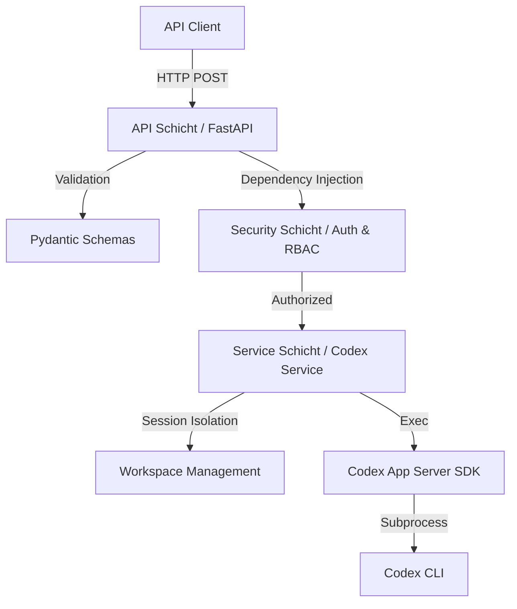

# OpenAI Codex Task Execution API

[](https://fastapi.tiangolo.com/)
[](https://www.python.org/)
[-green)](#enterprise-status)

Eine versionierte REST-API auf Basis von FastAPI für die professionelle Orchestrierung von OpenAI-Codex-Aufgaben. 

---

## 🚀 Das Problem & Die Lösung

**Das Problem:**  
Das OpenAI Codex SDK ist hervorragend für die lokale Ausführung von KI-Aufgaben geeignet, lässt sich aber nur schwer direkt in eine bestehende Enterprise-Infrastruktur integrieren. Es fehlen standardisierte Schnittstellen für Authentifizierung (SSO), Rollenprüfung, isolierte Arbeitsumgebungen und Audit-Logging.

**Die Lösung:**  
Diese API dient als **Enterprise-Bridge**. Sie kapselt das Codex-SDK in einem wartbaren FastAPI-Service und fügt alle notwendigen Enterprise-Funktionen hinzu:
- **SSO Integration**: Unterstützung für OIDC (Entra ID) und Trusted Proxy Header.
- **RBAC**: Rollenbasierte Zugriffskontrolle (Wer darf Tasks ausführen?).
- **Isolation**: Jede Anfrage erhält einen eigenen, isolierten Workspace (auf Basis von Templates).
- **Observability**: Request-korreliertes Logging und standardisierte Fehlerformate.

---

## 🏗️ Architektur & Datenfluss

Die Anwendung folgt einem sauberen Schichtenmodell (Clean Architecture), um Wartbarkeit und Testbarkeit zu gewährleisten.



---

## 📂 Projektstruktur

```text
my_rest_api/
├── app/                  # Quellcode der Anwendung
│   ├── api/              # HTTP-Endpunkte & Router (v1)
│   ├── core/             # Konfiguration, Logging, Exceptions
│   ├── security/         # Authentifizierung & Rollenprüfung
│   ├── schemas/          # Pydantic Request/Response Verträge
│   ├── services/         # Fachlogik (Codex Integration)
│   └── main.py           # Applikationseinstieg
├── config/               # Konfigurationsdateien
│   └── examples/         # Szenario-Beispiele (OIDC, Proxy, etc.)
├── docs/                 # Vertiefende Dokumentation
├── tests/                # Umfangreiche Testsuite (pytest)
└── start_server.sh       # Komfortabler Start-Skript
```

---

## ⚙️ Konfiguration

Die Anwendung nutzt ein flexibles Profil-System über [config/app.toml](config/app.toml).

### Beispiel-Szenarien
Wir haben fertige Konfigurationen für verschiedene Umgebungen vorbereitet:
- 🛠️ **[Lokal / Entwicklung](config/examples/local_dev.toml)**: Keine Auth, DEBUG-Logs.
- 🏢 **[Enterprise SSO (OIDC)](config/examples/enterprise_oidc.toml)**: Microsoft Entra ID Integration.
- 🔒 **[Trusted Proxy](config/examples/enterprise_trusted_header.toml)**: Auth über IIS/Nginx Header.
- 📁 **[Advanced Workspaces](config/examples/advanced_workspaces.toml)**: Nutzung von Projekt-Templates.

---

## 🛠️ Installation & Start

### Voraussetzungen
- Python 3.10+
- Installierte [Codex-CLI](https://github.com/openai/codex-app-server-sdk)

### Setup
```bash
python -m venv venv
source venv/bin/activate
pip install -r requirements.txt
```

### Starten
```bash
./start_server.sh
```

---

## 🚦 API Endpunkte (v1)

### Task Ausführung
`POST /api/v1/execute_task`

**Request:**
```json
{
  "task_description": "Erstelle eine Zusammenfassung der Datei README.md",
  "session_id": "optional-custom-id"
}
```

### Health & Monitoring
- `GET /api/v1/health/live`: Liveness Probe (Ist der Prozess am Leben?)
- `GET /api/v1/health/ready`: Readiness Probe (Sind alle Abhängigkeiten/Codex bereit?)

---

## 🧪 Testing

Das Projekt legt großen Wert auf Qualität. Die Testabdeckung umfasst Service-Logik, Security-Modi und API-Endpunkte.

```bash
pytest
```

---

## 📜 Lizenz & Contribution

Dieses Projekt ist unter der [MIT Lizenz](LICENSE) lizenziert. Beiträge sind willkommen! Bitte erstelle einen Issue oder einen Pull Request für Verbesserungsvorschläge.

---

## 🏁 Enterprise Status

Die Anwendung besitzt eine solide technische Basis. Für einen vollständigen produktiven Einsatz (Phase 2) sind folgende Erweiterungen geplant:
- [ ] Mandantenfähigkeit (Multi-Tenancy)
- [ ] Persistente Audit-Trails in einer Datenbank
- [ ] Rate Limiting & Job-Queuing
- [ ] Metriken & Tracing (Prometheus/Jaeger)

Details dazu im [DEVELOPER_GUIDE.md](docs/DEVELOPER_GUIDE.md).
