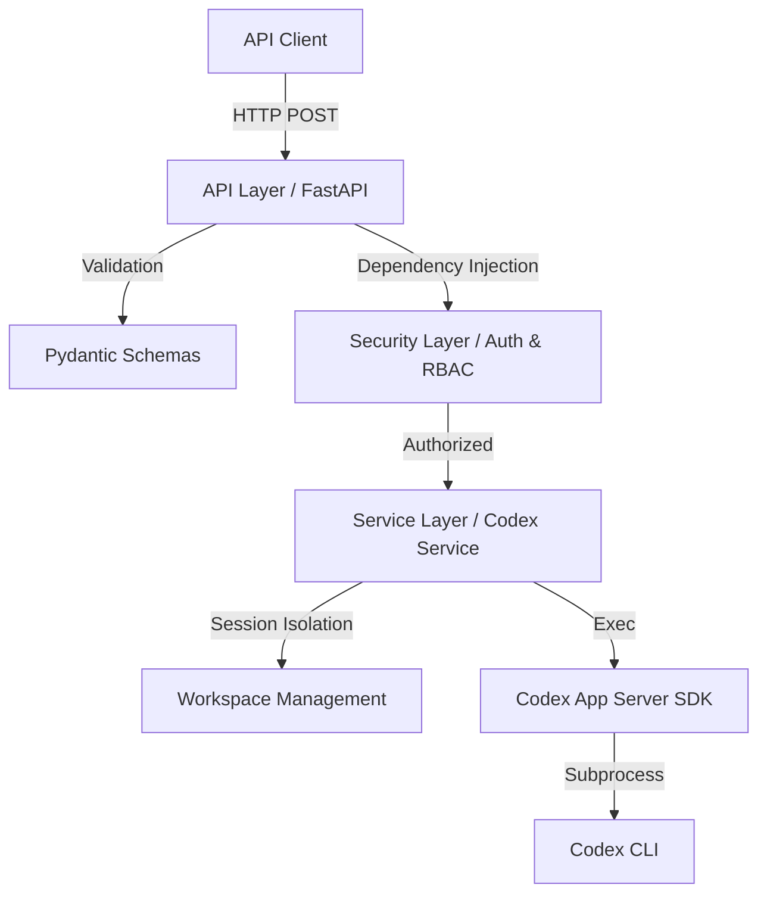

# OpenAI Codex Task Execution API

[English] | [Deutsch](README.de.md)

[](https://fastapi.tiangolo.com/)
[](https://www.python.org/)
[-green)](#enterprise-status)

A versioned REST API based on FastAPI for professional orchestration of OpenAI Codex tasks.

---

## 🚀 The Problem & The Solution

**The Problem:**  
The OpenAI Codex SDK is excellent for local AI task execution but difficult to integrate directly into existing enterprise infrastructure. It lacks standardized interfaces for authentication (SSO), role validation, isolated workspaces, and audit logging.

**The Solution:**  
This API serves as an **Enterprise Bridge**. It encapsulates the Codex SDK within a maintainable FastAPI service and adds all necessary enterprise features:
- **SSO Integration**: Support for OIDC (Entra ID) and Trusted Proxy Headers.
- **RBAC**: Role-based access control (Who is allowed to execute tasks?).
- **Isolation**: Each request receives its own isolated workspace (based on templates).
- **Observability**: Request-correlated logging and standardized error formats.

---

## 🏗️ Architecture & Data Flow

The application follows a Clean Architecture model to ensure maintainability and testability.



---

## 📂 Project Structure

```text
my_rest_api/
├── app/                  # Application source code
│   ├── api/              # HTTP endpoints & routers (v1)
│   ├── core/             # Configuration, logging, exceptions
│   ├── security/         # Authentication & role validation
│   ├── schemas/          # Pydantic request/response contracts
│   ├── services/         # Business logic (Codex integration)
│   └── main.py           # Application entry point
├── config/               # Configuration files
│   └── examples/         # Scenario examples (OIDC, Proxy, etc.)
├── docs/                 # Detailed documentation
├── tests/                # Comprehensive test suite (pytest)
└── start_server.sh       # Convenient startup script
```

---

## ⚙️ Configuration

The application uses a flexible profile system via [config/app.toml](config/app.toml).

### Example Scenarios
We have prepared ready-to-use configurations for various environments:
- 🛠️ **[Local / Development](config/examples/local_dev.toml)**: No auth, DEBUG logs.
- 🏢 **[Enterprise SSO (OIDC)](config/examples/enterprise_oidc.toml)**: Microsoft Entra ID integration.
- 🔒 **[Trusted Proxy](config/examples/enterprise_trusted_header.toml)**: Auth via IIS/Nginx headers.
- 📁 **[Advanced Workspaces](config/examples/advanced_workspaces.toml)**: Usage of project templates.

---

## 🛠️ Installation & Getting Started

### Prerequisites
- Python 3.10+
- Installed [Codex CLI](https://github.com/openai/codex-app-server-sdk)

### Setup
```bash
python -m venv venv
source venv/bin/activate
pip install -r requirements.txt
```

### Running
```bash
./start_server.sh
```

---

## 🚦 API Endpoints (v1)

### Task Execution
`POST /api/v1/execute_task`

**Request:**
```json
{
  "task_description": "Create a summary of the README.md file",
  "session_id": "optional-custom-id"
}
```

### Health & Monitoring
- `GET /api/v1/health/live`: Liveness Probe (Is the process alive?)
- `GET /api/v1/health/ready`: Readiness Probe (Are dependencies/Codex ready?)

---

## 🧪 Testing

The project emphasizes quality. The test suite covers service logic, security modes, and API endpoints.

```bash
pytest
```

---

## 📜 License & Contribution

This project is licensed under the [MIT License](LICENSE). Contributions are welcome! Please create an issue or a pull request for suggestions or improvements.

---

## 🏁 Enterprise Status

The application has a solid technical foundation. The following enhancements are planned for full production use (Phase 2):
- [ ] Multi-tenancy support
- [ ] Persistent audit trails in a database
- [ ] Rate limiting & job queuing
- [ ] Metrics & tracing (Prometheus/Jaeger)

For more details, see the **[Developer Guide](docs/DEVELOPER_GUIDE.en.md)**.
