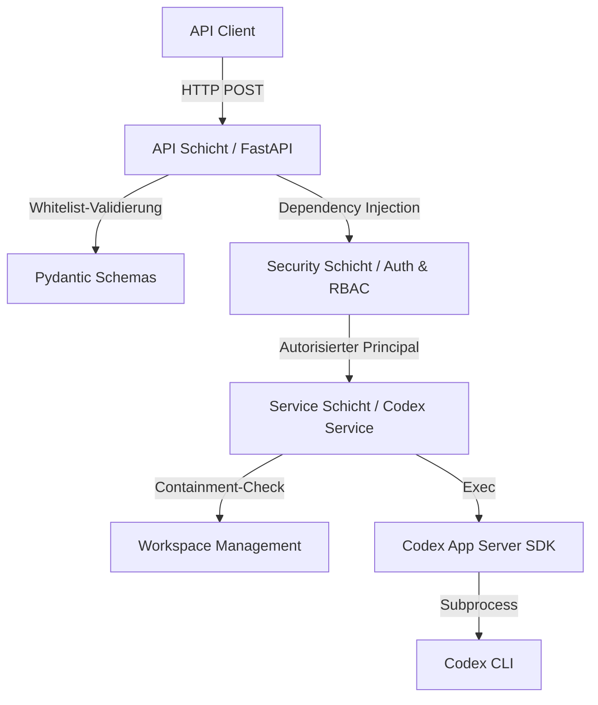

# OpenAI Codex Task Execution API

[English](README.md) | [Deutsch]

[](https://fastapi.tiangolo.com/)
[](https://www.python.org/)
[](#-testing)
[-green)](#-enterprise-status)

Eine versionierte REST-API auf Basis von FastAPI für die professionelle Orchestrierung von OpenAI-Codex-Aufgaben in Enterprise-Umgebungen.

---

## 🚀 Das Problem & Die Lösung

**Das Problem:**
Das OpenAI Codex SDK ist hervorragend für die lokale Ausführung von KI-Aufgaben geeignet, lässt sich aber nur schwer direkt in eine bestehende Enterprise-Infrastruktur integrieren. Es fehlen standardisierte Schnittstellen für Authentifizierung (SSO), Rollenprüfung, isolierte Arbeitsumgebungen und Audit-Logging.

**Die Lösung:**
Diese API dient als **Enterprise-Bridge**. Sie kapselt das Codex-SDK in einem wartbaren FastAPI-Service und fügt alle notwendigen Enterprise-Funktionen hinzu:

- **SSO-Integration**: Unterstützung für OIDC/JWT (z.B. Microsoft Entra ID) und Trusted Proxy Header.
- **RBAC**: Rollenbasierte Zugriffskontrolle – wer darf Tasks ausführen?
- **Workspace-Isolierung**: Jede Benutzersession erhält ein eigenes, isoliertes Dateisystem-Verzeichnis, optional aus einem Projekt-Template provisioniert.
- **Sicherheitsgehärtet**: Defense-in-Depth-Validierung aller Benutzereingaben (Path-Traversal-Prävention, Whitelist-Validierung).
- **Observability**: Request-korreliertes Logging, Health-Probes und ein integriertes Live-Monitoring für Administratoren.

---

## 🏗️ Architektur & Datenfluss

Die Anwendung folgt einem sauberen Schichtenmodell (Clean Architecture), um Wartbarkeit und Testbarkeit zu gewährleisten.



---

## 📂 Projektstruktur

```text
openaiSDK/
├── app/                        # Quellcode der Anwendung
│   ├── api/                    # HTTP-Endpunkte & Router (v1)
│   ├── core/                   # Konfiguration, Logging, Exceptions
│   ├── security/               # Authentifizierung & Rollenprüfung
│   ├── schemas/                # Pydantic Request/Response Verträge
│   ├── services/               # Fachlogik (Codex Integration)
│   └── main.py                 # Applikationseinstieg
├── config/                     # Konfigurationsdateien
│   ├── app.toml                # Hauptkonfiguration (profilbasiert)
│   └── examples/               # Fertige Szenario-Konfigurationen
│       ├── local_dev.toml                 # Lokale Entwicklung (keine Auth)
│       ├── enterprise_oidc.toml           # Microsoft Entra ID / OIDC
│       ├── enterprise_trusted_header.toml # Reverse-Proxy-Header-Auth
│       └── advanced_workspaces.toml       # Session-Workspace-Templates
├── docs/                       # Entwickler- & Dateireferenz-Guides
├── tests/                      # Umfangreiche Testsuite (pytest)
└── start_server.sh             # Komfortabler Start-Skript
```

---

## ⚙️ Konfiguration

Die Anwendung nutzt ein flexibles **Profil-System** über [`config/app.toml`](config/app.toml). Einstellungen können auf jeder Ebene überschrieben werden: Defaults → Profil → Umgebungsvariablen.

### Fertige Szenario-Konfigurationen

| Szenario | Datei | Beschreibung |
|---|---|---|
| 🛠️ Lokal / Entwicklung | [`local_dev.toml`](config/examples/local_dev.toml) | Keine Auth, DEBUG-Logs |
| 🏢 Enterprise SSO | [`enterprise_oidc.toml`](config/examples/enterprise_oidc.toml) | Microsoft Entra ID / OIDC JWT |
| 🔒 Trusted Proxy | [`enterprise_trusted_header.toml`](config/examples/enterprise_trusted_header.toml) | Auth über IIS/Nginx-Header |
| 📁 Workspaces | [`advanced_workspaces.toml`](config/examples/advanced_workspaces.toml) | Per-Session-Projekt-Templates |

### Umgebungsvariablen

Alle Einstellungen können über Umgebungsvariablen überschrieben werden – besonders nützlich für Docker/CI/CD-Deployments:

| Variable | Standard | Beschreibung |
|---|---|---|
| `HOST` | `127.0.0.1` | Bind-Adresse des uvicorn-Servers |
| `PORT` | `8000` | Bind-Port |
| `APP_CONFIG_FILE` | `config/app.toml` | Pfad zur TOML-Konfigurationsdatei |
| `APP_ACTIVE_PROFILE` | *(aus Config)* | Aktives Konfigurationsprofil überschreiben |
| `CODEX_BIN` | `codex` | Pfad zur Codex-CLI-Binärdatei |
| `CODEX_MODEL` | *(Codex-Standard)* | Modell für die Task-Ausführung überschreiben |
| `CODEX_PROJECT_SOURCE` | *(keiner)* | Template-Verzeichnis für neue Session-Workspaces |
| `CODEX_SESSIONS_BASE_PATH` | *(keiner)* | Root-Verzeichnis für Session-Workspace-Isolierung |
| `MONITORING_ENABLED` | `true` | Aktiviert das integrierte Live-Monitoring |
| `MONITORING_HISTORY_SIZE` | `100` | Anzahl zuletzt abgeschlossener Tasks im In-Memory-Verlauf |
| `MONITORING_STREAM_ENABLED` | `true` | Aktiviert den Server-Sent-Event-Stream für Live-Updates |
| `MONITORING_REFRESH_INTERVAL_MS` | `1000` | Empfohlenes Aktualisierungsintervall für Terminal-Clients |
| `UVICORN_LOG_LEVEL` | `info` | Uvicorn-Log-Verbosität (`debug`, `info`, `warning`, …) |
| `UVICORN_RELOAD` | `0` | Auf `1` setzen für Hot-Reload (nur Entwicklung) |

---

## 🛠️ Installation & Start

### Voraussetzungen

- Python 3.10+
- Installierte [Codex CLI](https://github.com/openai/codex-app-server-sdk)

### Setup

```bash
python -m venv venv
source venv/bin/activate
pip install -r requirements.txt
```

### Starten

```bash
./start_server.sh
```

Oder mit Umgebungsvariablen:

```bash
HOST=0.0.0.0 PORT=9000 APP_ACTIVE_PROFILE=production ./start_server.sh
```

---

## 🐳 Containerisierung (Optional)

Der Betrieb der API in einem Docker-Container ist eine optionale Methode für das Deployment. Dies ist besonders nützlich für Produktionsumgebungen oder wenn eine isolierte Ausführungsumgebung gewünscht ist.

### Schnellstart mit Docker Compose

1. **Bauen und Starten**:
   ```bash
   docker compose -f docker/docker-compose.yml up --build
   ```

2. **API aufrufen**:
   Die API ist standardmäßig unter `http://localhost:8000` erreichbar.

### Detaillierte Konfiguration

Das Docker-Image ist so konzipiert, dass es über Umgebungsvariablen und Volume-Mounts flexibel konfiguriert werden kann.

#### Umgebungsvariablen

Alle unter [Umgebungsvariablen](#umgebungsvariablen) gelisteten Einstellungen können an den Container übergeben werden:

```bash
docker run -p 8000:8000 \
  -e APP_ACTIVE_PROFILE=production \
  -e CODEX_MODEL=gpt-4 \
  codex-api
```

#### Konfiguration einbinden

Wenn du die Konfiguration lieber über eine TOML-Datei steuerst, kannst du diese in den Container mounten:

```bash
docker run -p 8000:8000 \
  -v $(pwd)/config/app.toml:/app/config/app.toml:ro \
  codex-api
```

#### Persistente Workspaces

Um Session-Workspaces auf dem Host-System zu speichern, mounte ein Verzeichnis für `CODEX_SESSIONS_BASE_PATH`:

```bash
docker run -p 8000:8000 \
  -v $(pwd)/mein_workspaces:/app/workspaces \
  -e CODEX_SESSIONS_BASE_PATH=/app/workspaces \
  codex-api
```

### Image manuell bauen

Falls du Docker Compose nicht nutzt, kannst du das Image direkt aus dem Projekt-Root bauen:

```bash
docker build -t codex-api -f docker/Dockerfile .
```

---

## 🚦 API-Endpunkte (v1)

### Task-Ausführung

`POST /api/v1/execute_task`

**Request:**
```json
{
  "task_description": "Erstelle eine Zusammenfassung der Datei README.md",
  "session_id": "alice-projekt-42"
}
```

| Feld | Typ | Pflicht | Beschreibung |
|---|---|---|---|
| `task_description` | string | ✅ | Natürlichsprachliche Aufgabenbeschreibung für Codex. 1–10.000 Zeichen. |
| `session_id` | string | ❌ | Workspace-Identifikator. Nur `[a-zA-Z0-9_-]`, max. 128 Zeichen. Standard: authentifizierter Username. |

**Response (200 OK):**
```json
{
  "result": "Hier ist die Zusammenfassung der README.md-Datei...",
  "logs": [],
  "metadata": {
    "request_id": "c5f3e239-0c72-4e4d-baa4-e601f7df62b8",
    "model": "gpt-4.1",
    "duration_ms": 1840,
    "completed_at": "2026-05-14T08:00:00Z"
  }
}
```

### Betriebs- und Monitoring-Endpunkte

| Endpunkt | Beschreibung |
|---|---|
| `GET /api/v1/health/live` | Liveness Probe – lebt der Prozess? |
| `GET /api/v1/health/ready` | Readiness Probe – sind Codex und Auth-Abhängigkeiten bereit? |
| `GET /api/v1/monitoring/snapshot` | Aktueller Live-Snapshot für Administratoren |
| `GET /api/v1/monitoring/events` | SSE-Stream mit Live-Ereignissen für Administratoren |

### Live-Monitoring für Administratoren

Das Monitoring verfolgt aktive Tasks, Sessions, Workspaces und kürzlich abgeschlossene Vorgänge direkt im API-Prozess. In produktiven Auth-Modi sind die Monitoring-Endpunkte nur für Benutzer mit Rolle `admin` freigegeben.

**Snapshot lokal abrufen (`auth.mode=disabled`):**

```bash
curl http://localhost:8000/api/v1/monitoring/snapshot
```

**Snapshot hinter Trusted Header / SSO abrufen:**

```bash
curl http://localhost:8000/api/v1/monitoring/snapshot \
  -H "X-Authenticated-User: alice" \
  -H "X-Authenticated-Roles: admin"
```

**Beispiel-Snapshot:**

```json
{
  "status": "up",
  "active_task_count": 1,
  "session_count": 2,
  "history_size": 100,
  "active_tasks": [
    {
      "request_id": "req-123",
      "session_id": "alice-projekt-42",
      "username": "alice",
      "status": "running",
      "task_preview": "Analysiere das Projekt und erstelle einen Maßnahmenplan",
      "model": "gpt-5.4",
      "workspace_path": "/srv/codex/sessions/alice-projekt-42",
      "workspace_state": "reused"
    }
  ],
  "recent_events": [
    {
      "event_id": 41,
      "event_type": "task_started",
      "message": "Task started for session alice-projekt-42"
    }
  ]
}
```

**Live-Ereignisse als SSE-Stream lesen:**

```bash
curl -N http://localhost:8000/api/v1/monitoring/events \
  -H "X-Authenticated-User: alice" \
  -H "X-Authenticated-Roles: admin"
```

**Terminal-TUI starten:**

```bash
python monitor_live.py --base-url http://127.0.0.1:8000/api/v1
python monitor_live.py --base-url http://127.0.0.1:8000/api/v1 --user alice --errors-only
```

---

## 🔐 Authentifizierung

Die API unterstützt drei Authentifizierungsmodi, konfiguriert über `auth.mode`:

### `disabled` (nur lokale Entwicklung)

Keine Credentials erforderlich. Alle Requests gelten als `local-development`-Principal mit Admin-Rolle.

> ⚠️ **`auth=disabled` darf niemals in Multi-User- oder Produktionsumgebungen eingesetzt werden.** Bei aktiver Session-Isolierung teilen sich alle Requests dasselbe Workspace-Verzeichnis.

### `oidc_jwt` — OIDC / Bearer Token

```bash
curl -X POST http://localhost:8000/api/v1/execute_task \
  -H "Authorization: Bearer <jwt_token>" \
  -H "Content-Type: application/json" \
  -d '{"task_description": "Liste alle Python-Dateien im Workspace auf"}'
```

Konfiguration über `enterprise_oidc.toml` oder die Umgebungsvariablen `OIDC_ISSUER`, `OIDC_AUDIENCE`, `OIDC_JWKS_URL`.

### `trusted_header` — Reverse Proxy / SSO-Header

```bash
curl -X POST http://localhost:8000/api/v1/execute_task \
  -H "X-Authenticated-User: alice" \
  -H "X-Authenticated-Roles: admin" \
  -H "Content-Type: application/json" \
  -d '{"task_description": "Liste alle Python-Dateien im Workspace auf"}'
```

Wird nur von IPs akzeptiert, die in `trusted_proxy_ips` eingetragen sind. Anfragen von anderen Quellen werden mit `401` abgewiesen.

---

## 📋 Fehlercodes

Alle Fehlerantworten folgen einem einheitlichen JSON-Format:

```json
{
  "error": {
    "code": "invalid_task_request",
    "message": "Codex hat den Task abgelehnt.",
    "details": "...",
    "request_id": "c5f3e239-..."
  }
}
```

| HTTP-Status | `error_code` | Ursache |
|---|---|---|
| `400` | `invalid_task_request` | Task inhaltlich abgelehnt oder ungültige `session_id` |
| `401` | `authentication_required` | Geschützter Endpunkt ohne Credentials aufgerufen |
| `401` | `authentication_failed` | Token ungültig, abgelaufen oder von nicht-vertrauenswürdiger Quelle |
| `403` | `authorization_denied` | Authentifizierter User hat nicht die erforderliche Rolle |
| `422` | *(Pydantic)* | Request-Body besteht Schema-Validierung nicht |
| `500` | `codex_execution_failed` | Unerwarteter Laufzeitfehler bei der Task-Ausführung |
| `500` | `configuration_error` | Server-Fehlkonfiguration (z.B. Codex-Binary nicht gefunden) |
| `503` | `codex_runtime_busy` | Codex-Runtime ist ausgelastet – bitte wiederholen |

---

## 🧪 Testing

Das Projekt legt großen Wert auf Qualität. Die Testsuite ist mehrschichtig aufgebaut.

```bash
# Alle Tests ausführen
pytest

# Mit Coverage-Bericht
pytest --cov=app --cov-report=term-missing

# Nur Security-/Adversarial-Tests
pytest tests/test_workspaces.py tests/test_security_deep.py -v
```

Die Testsuite deckt Konfiguration, Security, Monitoring, Workspace-Isolierung, Endpoint-Verträge und Terminal-Helfer gezielt ab.

| Testmodul | Schwerpunkt |
|---|---|
| `test_monitoring_service.py` | Live-State, Event-Historie, Fehlerfälle, Session-Sicht |
| `test_monitoring_api.py` | Admin-Endpunkte, SSE-Stream, Monitoring-Helpers |
| `test_monitor_live.py` | Header-Building, Filter, SSE-Parsing, Stream-Fehler |
| `test_dependencies.py` + `test_app_factory.py` | Dependency-Wiring, App-State, veröffentlichte Routen |
| `test_codex_service.py` | Service-Logik, Workspace-Provisionierung, Fehler-Mapping |
| `test_auth.py` + `test_security_service.py` | Auth-Modi, RBAC, Rollen-Auflösung |
| `test_security_deep.py` | Adversarial: Proxy-Injection, fehlerhafte Tokens, Claim-Injection |
| `test_workspaces.py` | Session-Isolierung, Path-Traversal-Prävention, Symlink-Behandlung |
| `test_schemas.py` | Eingabe-Validierung, `session_id`-Whitelist, Randfälle |
| `test_config.py` | Profilauflösung, Env-Overrides, Monitoring-Grenzwerte |
| `test_integration.py` | End-to-End-nahe Flows dort, wo die lokale Toolchain es stabil zulässt |

Zusätzliche nützliche Kommandos:

```bash
# Schneller Monitoring-Fokus
pytest tests/test_monitoring_service.py tests/test_monitoring_api.py tests/test_monitor_live.py tests/test_dependencies.py -v

# Konfiguration, Security und Service-Layer
pytest tests/test_config.py tests/test_auth.py tests/test_security_service.py tests/test_codex_service.py -v
```

---

## 🔒 Sicherheit

### Workspace-Isolierung

Jede `session_id` wird auf ein dediziertes Verzeichnis unter `CODEX_SESSIONS_BASE_PATH` abgebildet. Die Implementierung nutzt **Defense-in-Depth**:

1. **Schicht 1 – Schema-Validierung**: `session_id` wird gegen `^[a-zA-Z0-9_\-]+$` validiert. Path-Traversal-Zeichen (`/`, `..`, Null-Bytes, Leerzeichen etc.) werden an der API-Grenze mit `422` abgewiesen.
2. **Schicht 2 – Service-Containment-Check**: Nach `Path.resolve()` prüft der Service unabhängig, ob der aufgelöste Pfad physisch innerhalb von `CODEX_SESSIONS_BASE_PATH` liegt. Damit werden auch zukünftige Bypass-Varianten abgefangen.

### Sicherheitsprobleme melden

Falls eine Sicherheitslücke entdeckt wird, bitte ein **privates GitHub-Issue** erstellen oder die Maintainer direkt kontaktieren. Bitte keine öffentliche Offenlegung vor der Behebung.

---

## 📜 Lizenz & Beiträge

Dieses Projekt ist unter der [MIT Lizenz](LICENSE) lizenziert. Beiträge sind willkommen!

Bitte zunächst ein **Issue erstellen**, um die geplante Änderung zu diskutieren, bevor ein Pull Request geöffnet wird. Details zur Entwicklungsumgebung und Architektur finden sich im **[Developer Guide](docs/DEVELOPER_GUIDE.de.md)** und in der **[Dateireferenz](docs/FILE_REFERENCE.de.md)**.

---

## 🏁 Enterprise Status

Die Anwendung besitzt eine solide, sicherheitsgehärtete technische Basis. Für einen vollständigen produktiven Einsatz (Phase 2) sind folgende Erweiterungen geplant:

- [ ] Mandantenfähigkeit (Multi-Tenancy)
- [ ] Persistente Audit-Trails in einer Datenbank
- [ ] Rate Limiting & Job-Queuing
- [ ] Metriken & Tracing (Prometheus/Jaeger)

Details dazu im **[Developer Guide](docs/DEVELOPER_GUIDE.de.md)**.
