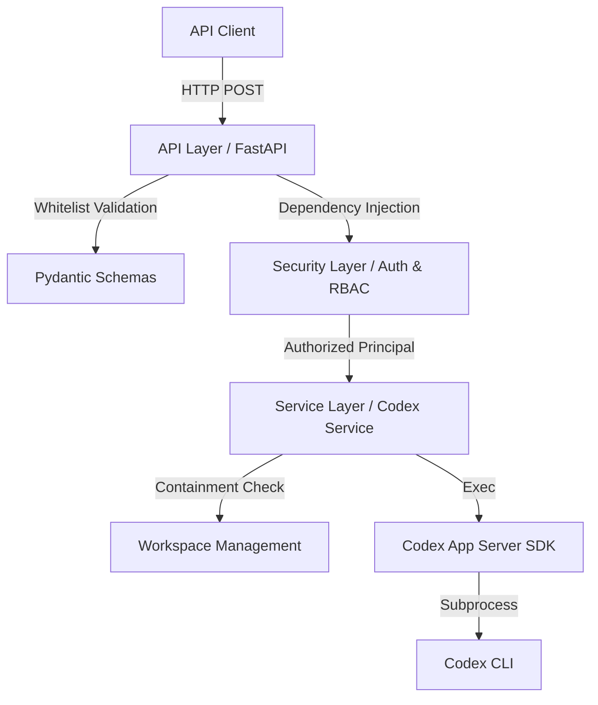

# OpenAI Codex Task Execution API

[English] | [Deutsch](README.de.md)

[](https://fastapi.tiangolo.com/)
[](https://www.python.org/)
[](#-testing)
[-green)](#-enterprise-status)

A versioned REST API based on FastAPI for professional orchestration of OpenAI Codex tasks in enterprise environments.

---

## 🚀 The Problem & The Solution

**The Problem:**
The OpenAI Codex SDK is excellent for local AI task execution but difficult to integrate directly into existing enterprise infrastructure. It lacks standardized interfaces for authentication (SSO), role validation, isolated workspaces, and audit logging.

**The Solution:**
This API serves as an **Enterprise Bridge**. It encapsulates the Codex SDK within a maintainable FastAPI service and adds all necessary enterprise features:

- **SSO Integration**: Support for OIDC/JWT (e.g. Microsoft Entra ID) and Trusted Proxy Headers.
- **RBAC**: Role-based access control — who is allowed to execute tasks?
- **Workspace Isolation**: Each user session receives its own isolated filesystem workspace, optionally provisioned from a project template.
- **Security-hardened**: Defense-in-depth validation on all user inputs (path traversal prevention, whitelist validation).
- **Observability**: Request-correlated logging, health probes, and integrated live monitoring for administrators.

---

## 🏗️ Architecture & Data Flow

The application follows a Clean Architecture model to ensure maintainability and testability.



---

## 📂 Project Structure

```text
openaiSDK/
├── app/                        # Application source code
│   ├── api/                    # HTTP endpoints & routers (v1)
│   ├── core/                   # Configuration, logging, exceptions
│   ├── security/               # Authentication & role validation
│   ├── schemas/                # Pydantic request/response contracts
│   ├── services/               # Business logic (Codex integration)
│   └── main.py                 # Application entry point
├── config/                     # Configuration files
│   ├── app.toml                # Main configuration (profile-based)
│   └── examples/               # Ready-to-use scenario configs
│       ├── local_dev.toml      # Local development (no auth)
│       ├── enterprise_oidc.toml          # Microsoft Entra ID / OIDC
│       ├── enterprise_trusted_header.toml # Reverse proxy header auth
│       └── advanced_workspaces.toml      # Session workspace templates
├── docs/                       # Developer & file reference guides
├── tests/                      # Comprehensive test suite (pytest)
└── start_server.sh             # Convenient startup script
```

---

## ⚙️ Configuration

The application uses a flexible **profile system** via [`config/app.toml`](config/app.toml). Settings can be overridden at any level: defaults → profile → environment variables.

### Ready-to-Use Scenario Configs

| Scenario | File | Description |
|---|---|---|
| 🛠️ Local / Dev | [`local_dev.toml`](config/examples/local_dev.toml) | No auth, DEBUG logs |
| 🏢 Enterprise SSO | [`enterprise_oidc.toml`](config/examples/enterprise_oidc.toml) | Microsoft Entra ID / OIDC JWT |
| 🔒 Trusted Proxy | [`enterprise_trusted_header.toml`](config/examples/enterprise_trusted_header.toml) | Auth via IIS/Nginx headers |
| 📁 Workspaces | [`advanced_workspaces.toml`](config/examples/advanced_workspaces.toml) | Per-session project templates |

### Environment Variables

All settings can be overridden via environment variables — useful for Docker/CI/CD deployments:

| Variable | Default | Description |
|---|---|---|
| `HOST` | `127.0.0.1` | Bind address for the uvicorn server |
| `PORT` | `8000` | Bind port |
| `APP_CONFIG_FILE` | `config/app.toml` | Path to the TOML configuration file |
| `APP_ACTIVE_PROFILE` | *(from config)* | Override the active config profile |
| `CODEX_BIN` | `codex` | Path to the Codex CLI binary |
| `CODEX_MODEL` | *(Codex default)* | Override the model used for task execution |
| `CODEX_PROJECT_SOURCE` | *(none)* | Template directory copied into new session workspaces |
| `CODEX_SESSIONS_BASE_PATH` | *(none)* | Root directory for per-session workspace isolation |
| `MONITORING_ENABLED` | `true` | Enables integrated live monitoring |
| `MONITORING_HISTORY_SIZE` | `100` | Number of recently completed tasks kept in memory |
| `MONITORING_STREAM_ENABLED` | `true` | Enables the server-sent event stream for live updates |
| `MONITORING_REFRESH_INTERVAL_MS` | `1000` | Suggested refresh interval for terminal clients |
| `UVICORN_LOG_LEVEL` | `info` | Uvicorn log verbosity (`debug`, `info`, `warning`, …) |
| `UVICORN_RELOAD` | `0` | Set to `1` to enable hot-reload (development only) |

---

## 🛠️ Installation & Getting Started

### Prerequisites

- Python 3.10+
- Installed [Codex CLI](https://github.com/openai/codex-app-server-sdk)

### Setup

```bash
python -m venv venv
source venv/bin/activate
pip install -r requirements.txt
```

### Running

```bash
./start_server.sh
```

Or with environment variable overrides:

```bash
HOST=0.0.0.0 PORT=9000 APP_ACTIVE_PROFILE=production ./start_server.sh
```

---

## 🐳 Containerization (Optional)

Running the API in a Docker container is an optional method for deployment. This is particularly useful for production environments or when you want to isolate the execution environment.

### Quick Start with Docker Compose

1. **Build and Start**:
   ```bash
   docker compose -f docker/docker-compose.yml up --build
   ```

2. **Access the API**:
   The API will be available at `http://localhost:8000`.

### Detailed Configuration

The Docker image is designed to be highly configurable via environment variables and volume mounts.

#### Environment Variables

All settings listed in the [Environment Variables](#environment-variables) section can be passed to the container:

```bash
docker run -p 8000:8000 \
  -e APP_ACTIVE_PROFILE=production \
  -e CODEX_MODEL=gpt-4 \
  codex-api
```

#### Mounting Configuration

If you prefer using a TOML file for configuration, you can mount it into the container:

```bash
docker run -p 8000:8000 \
  -v $(pwd)/config/app.toml:/app/config/app.toml:ro \
  codex-api
```

#### Persistent Workspaces

To persist session workspaces on the host, mount a directory to `CODEX_SESSIONS_BASE_PATH`:

```bash
docker run -p 8000:8000 \
  -v $(pwd)/my_workspaces:/app/workspaces \
  -e CODEX_SESSIONS_BASE_PATH=/app/workspaces \
  codex-api
```

### Building the Image Manually

If you don't use Docker Compose, you can build the image from the project root:

```bash
docker build -t codex-api -f docker/Dockerfile .
```

---

## 🚦 API Endpoints (v1)

### Task Execution

`POST /api/v1/execute_task`

**Request:**
```json
{
  "task_description": "Create a summary of the README.md file",
  "session_id": "alice-project-42"
}
```

| Field | Type | Required | Description |
|---|---|---|---|
| `task_description` | string | ✅ | Natural-language instruction for Codex. 1–10,000 characters. |
| `session_id` | string | ❌ | Workspace isolator. Only `[a-zA-Z0-9_-]`, max 128 chars. Defaults to the authenticated username. |

**Response (200 OK):**
```json
{
  "result": "Here is a summary of the README.md file...",
  "logs": [],
  "metadata": {
    "request_id": "c5f3e239-0c72-4e4d-baa4-e601f7df62b8",
    "model": "gpt-4.1",
    "duration_ms": 1840,
    "completed_at": "2026-05-14T08:00:00Z"
  }
}
```

### Operational and Monitoring Endpoints

| Endpoint | Description |
|---|---|
| `GET /api/v1/health/live` | Liveness probe — is the process running? |
| `GET /api/v1/health/ready` | Readiness probe — are Codex and auth dependencies available? |
| `GET /api/v1/monitoring/snapshot` | Current live snapshot for administrators |
| `GET /api/v1/monitoring/events` | SSE stream with live runtime events for administrators |

### Live Monitoring for Administrators

The monitoring subsystem tracks active tasks, sessions, workspaces, and recently completed operations directly inside the API process. In production auth modes, the monitoring endpoints are restricted to users with the `admin` role.

**Read a snapshot locally (`auth.mode=disabled`):**

```bash
curl http://localhost:8000/api/v1/monitoring/snapshot
```

**Read a snapshot behind trusted headers / SSO:**

```bash
curl http://localhost:8000/api/v1/monitoring/snapshot \
  -H "X-Authenticated-User: alice" \
  -H "X-Authenticated-Roles: admin"
```

**Example snapshot:**

```json
{
  "status": "up",
  "active_task_count": 1,
  "session_count": 2,
  "history_size": 100,
  "active_tasks": [
    {
      "request_id": "req-123",
      "session_id": "alice-project-42",
      "username": "alice",
      "status": "running",
      "task_preview": "Analyze the project and create an action plan",
      "model": "gpt-5.4",
      "workspace_path": "/srv/codex/sessions/alice-project-42",
      "workspace_state": "reused"
    }
  ],
  "recent_events": [
    {
      "event_id": 41,
      "event_type": "task_started",
      "message": "Task started for session alice-project-42"
    }
  ]
}
```

**Read live events via SSE:**

```bash
curl -N http://localhost:8000/api/v1/monitoring/events \
  -H "X-Authenticated-User: alice" \
  -H "X-Authenticated-Roles: admin"
```

**Launch the terminal TUI:**

```bash
python monitor_live.py --base-url http://127.0.0.1:8000/api/v1
python monitor_live.py --base-url http://127.0.0.1:8000/api/v1 --user alice --errors-only
```

---

## 🔐 Authentication

The API supports three authentication modes configured via `auth.mode`:

### `disabled` (local development only)

No credentials required. All requests are treated as the `local-development` principal with admin role.

> ⚠️ **Never use `auth=disabled` in multi-user or production environments.** All requests share the same workspace when session isolation is active.

### `oidc_jwt` — OIDC / Bearer Token

```bash
curl -X POST http://localhost:8000/api/v1/execute_task \
  -H "Authorization: Bearer <your_jwt_token>" \
  -H "Content-Type: application/json" \
  -d '{"task_description": "List all Python files in the workspace"}'
```

Configure via `enterprise_oidc.toml` or environment variables (`OIDC_ISSUER`, `OIDC_AUDIENCE`, `OIDC_JWKS_URL`).

### `trusted_header` — Reverse Proxy / SSO Header

```bash
curl -X POST http://localhost:8000/api/v1/execute_task \
  -H "X-Authenticated-User: alice" \
  -H "X-Authenticated-Roles: admin" \
  -H "Content-Type: application/json" \
  -d '{"task_description": "List all Python files in the workspace"}'
```

Only accepted from IPs listed in `trusted_proxy_ips`. Requests from other sources are rejected with `401`.

---

## 📋 Error Codes

All errors follow a consistent JSON structure:

```json
{
  "error": {
    "code": "invalid_task_request",
    "message": "Codex rejected the submitted task request.",
    "details": "...",
    "request_id": "c5f3e239-..."
  }
}
```

| HTTP Status | `error_code` | Cause |
|---|---|---|
| `400` | `invalid_task_request` | Task content rejected by Codex or invalid `session_id` |
| `401` | `authentication_required` | Protected endpoint called without credentials |
| `401` | `authentication_failed` | Token invalid, expired, or from untrusted source |
| `403` | `authorization_denied` | Authenticated user lacks the required role |
| `422` | *(Pydantic)* | Request body fails schema validation |
| `500` | `codex_execution_failed` | Unexpected runtime failure during task execution |
| `500` | `configuration_error` | Server misconfiguration (e.g. missing Codex binary) |
| `503` | `codex_runtime_busy` | Codex runtime is currently at capacity — retry later |

---

## 🧪 Testing

The project emphasizes quality with a comprehensive, layered test suite.

```bash
# Run all tests
pytest

# Run with coverage report
pytest --cov=app --cov-report=term-missing

# Run only security/adversarial tests
pytest tests/test_workspaces.py tests/test_security_deep.py -v
```

The test suite now covers configuration, security, monitoring, workspace isolation, endpoint contracts, and terminal helpers in a targeted way.

| Test Module | Focus |
|---|---|
| `test_monitoring_service.py` | Live runtime state, event history, failure handling, session views |
| `test_monitoring_api.py` | Admin endpoints, SSE streaming, monitoring endpoint helpers |
| `test_monitor_live.py` | Header building, filters, SSE parsing, stream error handling |
| `test_dependencies.py` + `test_app_factory.py` | Dependency wiring, app state, published routes |
| `test_codex_service.py` | Service logic, workspace provisioning, error mapping |
| `test_auth.py` + `test_security_service.py` | Authentication modes, RBAC, role resolution |
| `test_security_deep.py` | Adversarial: proxy injection, malformed tokens, claim injection |
| `test_workspaces.py` | Session isolation, path traversal prevention, symlink handling |
| `test_schemas.py` | Input validation, `session_id` whitelist, edge cases |
| `test_config.py` | Profile resolution, env overrides, monitoring clamps |
| `test_integration.py` | Near end-to-end flows where the local toolchain remains stable |

Additional useful commands:

```bash
# Fast monitoring-focused verification
pytest tests/test_monitoring_service.py tests/test_monitoring_api.py tests/test_monitor_live.py tests/test_dependencies.py -v

# Configuration, security, and service-layer verification
pytest tests/test_config.py tests/test_auth.py tests/test_security_service.py tests/test_codex_service.py -v
```

---

## 🔒 Security

### Workspace Isolation

Each `session_id` maps to a dedicated directory under `CODEX_SESSIONS_BASE_PATH`. The implementation uses **Defense-in-Depth**:

1. **Layer 1 – Schema Validation**: `session_id` is validated against `^[a-zA-Z0-9_\-]+$`. Path traversal characters (`/`, `..`, null bytes, spaces, etc.) are rejected at the API boundary with `422`.
2. **Layer 2 – Service Containment Check**: After `Path.resolve()`, the service independently verifies the resolved path is physically inside `CODEX_SESSIONS_BASE_PATH`. This catches any bypass that might circumvent Layer 1.

### Reporting Security Issues

If you discover a security vulnerability, please open a **private GitHub issue** or contact the maintainers directly. Do not disclose security issues publicly before they are resolved.

---

## 📜 License & Contributing

This project is licensed under the [MIT License](LICENSE). Contributions are welcome!

Please create an **issue** to discuss your idea before opening a pull request. For development setup and architectural details, see the **[Developer Guide](docs/DEVELOPER_GUIDE.md)** and **[File Reference](docs/FILE_REFERENCE.md)**.

---

## 🏁 Enterprise Status

The application has a solid, security-hardened technical foundation. The following enhancements are planned for full production use (Phase 2):

- [ ] Multi-tenancy support
- [ ] Persistent audit trails in a database
- [ ] Rate limiting & job queuing
- [ ] Metrics & tracing (Prometheus/Jaeger)

For architecture details and extension points, see the **[Developer Guide](docs/DEVELOPER_GUIDE.md)**.
